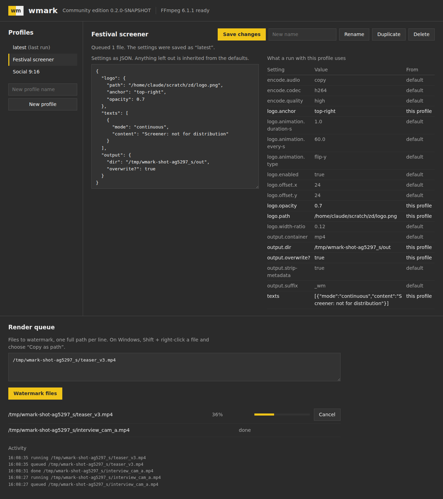

# clogem-wmark

Batch video watermarking that makes AI watermark removal harder. wmark adds a
logo that periodically flips in 3D (a per-frame homography, so a fixed-box
inpainter can't simply erase it), warning text in continuous or scheduled
mode, and schedules keyed per video. It ships as one native binary: double-click
it and a local web UI opens. The same engine serves a REST API, a CLI and a
terminal client.

This repository is the **open core** of wmark, licensed under the
[Eclipse Public License 2.0](LICENSE). Commercial editions (keyed canary
frames, randomised text, offline licenses, the hosted service and the apps)
are built on top of it separately; nothing here depends on them.



## How it's built

- **One headless engine, many clients** (the Clash model): the built-in web UI,
  the CLI, `wmark-tui`, scripts and GUI shells all use the same Core API.
- **A portable kernel** (`kernel/`, `.cljc` only) turns settings into an
  engine-neutral **render spec**: pixels and frame indices, with normative
  reference semantics and golden vectors. ClojureDart can compile it for
  Flutter apps.
- **Pluggable engines** behind one protocol:
  - FFmpeg, driven through a filtergraph built from data;
  - any native library that implements the C ABI in
    `native/include/wmark_engine.h` (AVFoundation, Media3, a GPU core),
    loaded through Java's Foreign Function & Memory API.

  A conformance harness measures real frames against the reference semantics.
- **Web UI without a JavaScript toolchain:** server-rendered HTML and
  [Datastar](https://data-star.dev) over server-sent events, under a per-page
  nonce CSP. No Node.js, no npm, no build step.
- **Profiles with fallback and provenance:** every run saves its settings as
  `latest`; the next run falls back to it field by field, and the UI shows
  which layer each value came from.
- **GraalVM native images** for Windows, macOS and Linux, from JDK 25 code
  with zero reflection warnings.

## Quick start

Requirements:
- JDK 25;
- [Babashka](https://babashka.org), whose `bb clojure` stands in for the
  Clojure CLI;
- a *full* FFmpeg build, including `drawtext`, placed next to the binary, in a
  `bin/` folder beside it, or on PATH.

GraalVM 25 is needed only for native binaries.
[docs/RUNBOOK.md](docs/RUNBOOK.md) has per-OS setup and every build command.

```bash
bb dev             # run from source: starts the server and opens the web UI
bb dev doctor      # which engine and FFmpeg were found, and from where
bb dev run --logo logo.png --text "(c) Studio" clip.mp4    # CLI render
bb tui             # terminal client for the running server
bb test            # every test (the C-compiler and FFmpeg groups skip themselves if absent)
bb e2e             # the web UI in Chromium (needs Python Playwright; test tooling only)
bb lint            # the build matrix and component deps.edn files vs the repository
bb native          # GraalVM native binary for this OS -> target/bin/
bb bundle :bundle :desktop-server :ffmpeg-dir /path/to/ffmpeg/bin   # the download, in dist/
```

## Using it

```
wmark                         start the local UI (what a double-click does)
wmark serve [--port N]        headless server for the TUI, scripts or a GUI
      --announce json         print the endpoint as one JSON line (for a parent process)
      --parent-pid PID        exit when that process exits
      --ui-dir DIR            serve an external UI instead of the built-in one
wmark run [flags] FILES...    render; flags override the profile, which overrides defaults
      -p/--profile NAME       base profile (default: latest = your last run)
      --clean                 ignore profiles
      --logo --anchor --offset-x --offset-y --logo-width --opacity
      --flip-every --flip-duration --static-logo
      --text / --text-file    warning text; --text-mode continuous|scheduled
      --text-at 1,5 --text-duration 2
      -o/--out DIR  --dry-run (prints the render spec summary, FFmpeg command and filtergraph)
wmark profiles list | show | save NAME [flags] | rename | copy | delete
wmark doctor                  which engine and FFmpeg binaries were found, and why

Global options:
      --home DIR              data folder (default: WMARK_HOME, ./wmark-data, else per-user)
      --ffmpeg PATH           ffmpeg file or folder (default: ./, ./bin/, wmark's folder, its bin/, PATH)
      --ffmpeg-search ORDER   e.g. app,app-bin,path to skip the working folder
      --engine ffmpeg|native  --native-lib PATH   (a library implementing native/include/wmark_engine.h)
```

## Layout

```
kernel/     portable .cljc: settings schema and resolution, render spec and reference
            semantics, keyed seeds, SplitMix64, text-mode registry, engine protocol
src/        JVM host core: profile rules, store/media/queue ports, job pipeline,
            Core API, FFmpeg and native engines, REST routes
web/        built-in UI: escaping hiccup, Datastar SSE events, views, handler;
            vendored datastar.js (MIT) and app.css
desktop/    CLI, http-kit server, loopback security, sidecar mode, native-image metadata
tui/        wmark-tui, a line-mode REST client
native/     wmark_engine.h (C ABI), a mock engine, exported JSON Schemas
testkit/    conformance harness, store contract, golden vectors, architecture checks
build/      wmark.build: interprets the build matrix in deps.edn
test/       tests, including test/e2e (browser smoke test)
spikes/     experiments kept as evidence (not built)
docs/       RUNBOOK, ARCHITECTURE, ENGINE, FFMPEG_STRATEGY, ROADMAP
```

`kernel/`, `web/`, `desktop/`, `tui/`, `testkit/` and `build/` each have a
`deps.edn`, so other projects can depend on one of them from git:

```clojure
wmark/desktop {:git/url "https://github.com/<owner>/clogem-wmark.git" :git/sha "..." :deps/root "desktop"}
```

## Documentation

- [Runbook](docs/RUNBOOK.md): toolchains, dev loop, tests, builds,
  troubleshooting.
- [Architecture](docs/ARCHITECTURE.md): components, ports, dependency rules,
  the web UI, profiles, security, tests.
- [The engine contract](docs/ENGINE.md): what an AVFoundation, Media3 or Rust
  engine implements.
- [FFmpeg strategy](docs/FFMPEG_STRATEGY.md): binary lookup, the filtergraph,
  the flip, encoding, verification, and the honest threat model.
- [Roadmap](docs/ROADMAP.md): stages, decisions and technology assessments.
- [CLAUDE.md](CLAUDE.md): the standing context for Claude Code sessions (and a
  good summary of the invariants for humans too).

## Threat model, briefly

Visible marks raise the cost of removal; they don't make it impossible. Keyed
schedules make marks evidence of ownership, not a barrier. The details are in
[the FFmpeg strategy](docs/FFMPEG_STRATEGY.md#what-this-does-and-doesnt-stop).

## Contributing

Contributions are welcome under the EPL-2.0 with a DCO sign-off
(`git commit -s`). See [CONTRIBUTING.md](CONTRIBUTING.md).

## License

Copyright (c) 2026 the clogem-wmark authors. Licensed under the
[Eclipse Public License 2.0](LICENSE); see [NOTICE](NOTICE) for third-party
material (Datastar, MIT). Every source file carries
`SPDX-License-Identifier: EPL-2.0`.
