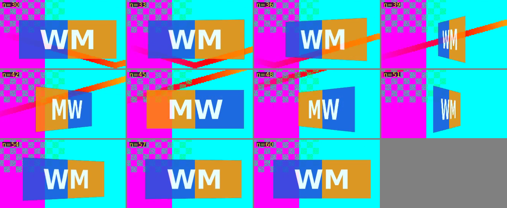

# FFmpeg strategy

The FFmpeg engine (`watermark.engine.ffmpeg`) is one implementation of the
engine protocol described in [ENGINE.md](ENGINE.md). It receives a render spec
in which every setting is already resolved to pixels and frame indices, and
compiles it into one FFmpeg invocation per input. It never builds command
strings by hand:

- `engine.ffmpeg.graph` turns data into a filtergraph.
- `engine.ffmpeg.compile` turns a render request into an argv.
- FFmpeg reads the graph from a script file.

Everything below was checked against real renders; see "Verification".

## Finding the binaries

The goal is a zero-dependency install: unzip and run, with no FFmpeg on the
system. The first hit wins:

| # | Where | Example on Windows |
|---|---|---|
| 1 | `--ffmpeg PATH` or `WMARK_FFMPEG` (a file or a folder) | `--ffmpeg D:\tools\ffmpeg\bin` |
| 2 | the working directory | `.\ffmpeg.exe` |
| 3 | its `bin\` folder | `.\bin\ffmpeg.exe` |
| 4 | wmark's own folder | `C:\Program Files\wmark\ffmpeg.exe` |
| 5 | its `bin\` folder | `C:\Program Files\wmark\bin\ffmpeg.exe` |
| 6 | the system `PATH` | |

- **Why steps 4 and 5.** A double-click starts wmark in its own folder, so
  steps 2 and 3 find the bundle. A Start-menu shortcut, a Finder launch
  (working directory `/`) or a terminal opened elsewhere doesn't. Without
  steps 4 and 5, those launches would skip the bundled FFmpeg and fall back to
  whatever is on PATH.
- **ffprobe comes from the same folder** as the ffmpeg that was found, so a
  bundle is never paired with a different version from PATH. The full search
  is the fallback, and `doctor` warns when the two came from different
  folders: a bundle missing its own ffprobe works on a developer's machine
  and fails on a clean one.
- **Only usable files count.** A file that exists but isn't executable is
  recorded as `unusable` and skipped.
- **Absolute paths only.** wmark always executes the absolute path it
  resolved, so the operating system's own implicit search never applies.
- **Everything is explained.** `wmark doctor` and `GET /api/v1/doctor` list
  every candidate with `found`, `missing` or `unusable`, and where the binary
  came from.

**Security note: this order enables binary planting.** Looking in the working
directory first is how planting attacks work: a malicious `ffmpeg.exe` in a
Downloads folder runs if the user starts wmark from there. Go removed implicit
current-directory lookups in 1.19 for exactly this reason. The order is kept
as requested, with these mitigations:

- The source of every binary is reported.
- A warning appears when FFmpeg came from the working directory while wmark
  itself is installed elsewhere.
- `--ffmpeg-search app,app-bin,path` (or `WMARK_FFMPEG_SEARCH`) removes the
  working-directory steps. Consider making it the default for managed or
  enterprise deployments.
- The release bundle keeps FFmpeg in `bin/` beside wmark, which steps 4–5
  find even under the hardened order.

## Capabilities

On first use the engine runs `ffmpeg -version`, `-filters` and `-encoders`
and derives what it can render:

- **Required filters:** `split crop drawbox format scale colorchannelmixer
  setpts overlay perspective fps null`. A test checks this list against every
  filter the compiler can emit.
- **Text under render spec v1 needs `drawtext`,** which needs libfreetype,
  and libharfbuzz since FFmpeg 7.0. Minimal builds often lack it (a 7.0.2
  static build tested here did). Without it, the job pipeline gives specs
  with text to render spec v2: wmark draws the text and FFmpeg composites
  it with `overlay`. `doctor` notes this. Only a build without `overlay`
  too refuses text layers, up front with `:unsupported`. **Ship a full
  build next to the binary** all the same.
- **Codec families** come from the encoders present (see "Encoding").
- **`perspective` is GPL-only.** FFmpeg builds it only with `--enable-gpl`, so
  LGPL builds (BtbN's `lgpl` variants, for instance) can't draw the flip
  themselves. They don't need to: render spec v2 draws it on the host.
  Release downloads carry pinned **LGPL** builds: BtbN's for Linux and
  Windows, and on macOS FFmpeg's signed source built with a fixed recipe
  ([ADR 0001](adr/0001-ffmpeg-in-release-bundles.md)).
- **Render spec v2 needs only `overlay`** (plus `fps` and `null`:
  `required-filters-v2`, tested like the v1 list), and neither
  `perspective` nor `drawtext`. A build without `perspective` is a complete
  engine that takes v2 specs only (`:spec-versions #{2}`): wmark draws the
  flip and the text itself, and the CLI, the UI and the API give such a
  build v2 automatically. `doctor` notes it
  ([ADR 0006](adr/0006-render-spec-v2-host-rendered-overlays.md)).
- **The logo is decoded by FFmpeg** for v2 (`decode-still`: one
  `-frames:v 1 -f rawvideo -pix_fmt rgba` call), so every image format
  FFmpeg reads works, and wmark's host code needs no image library.
- **FFmpeg 9 prints two flag columns** in `-filters` where earlier releases
  printed three; the parser reads both (tested with lines from 6.1.1 and
  9.0.1).

Problems and warnings appear in `wmark doctor` and in `/api/v1/health`.

## One invocation per input

```
ffmpeg -hide_banner -nostdin -y -loglevel error -progress pipe:1 -nostats
       -i INPUT
       -i LOGO.png                            # a single still frame
       -/filter_complex graph.txt             # FFmpeg >= 7.0; older: -filter_complex_script
       -map [vout] -map 0:a? -c:a copy
       -c:v libx264 -crf 18 -preset medium -pix_fmt yuv420p
       -fps_mode:v passthrough                # FFmpeg >= 5.1; older: -vsync passthrough
       -map_metadata -1 -movflags +faststart
       OUTPUT.part.mp4                        # published atomically on success
```

- **Graph in a file.** Windows limits a command line to 32,767 characters and
  quoting there is fragile. `-filter_complex_script` was deprecated in FFmpeg
  7.0 in favour of the generic file prefix `-/filter_complex`. The engine
  parses `ffmpeg -version` and picks the right flag. Nightly builds with no
  release number count as new.
- **Frames pass through unchanged.** FFmpeg's default constant-rate sync
  duplicates or drops frames to fill timestamp gaps. With AAC priming, the
  audio starts a few milliseconds before the video, and FFmpeg repeated frame 0
  to cover the gap. Every later frame then sat one position late against the
  watermark schedule, which breaks frame-exact evidence. The conformance
  harness caught this; `passthrough` fixes it.
- **Progress and logs.** Progress is read from stdout. stderr goes to a log
  file, not a pipe, so FFmpeg can never block on a full pipe buffer.
- **Scratch files.** The graph and text files live in a per-render scratch
  folder. It is deleted after success or cancellation and kept after a failure,
  for support.
- **Publishing.** Output names and publishing belong to the job pipeline:
  it commits the `.part` file after success and discards it otherwise.

## Graph layout

```
[0:v]fps=<fps>[base];                                      variable-frame-rate input only
[1:v]format=rgba,scale=<w>:<h>,colorchannelmixer=aa=<opacity>,setpts=PTS-STARTPTS[still1];
[base]split[main1][tick1];
[tick1]crop=<card canvas>,format=rgba,drawbox=...:color=black@0:t=fill:replace=1[canvas1];
[canvas1][still1]overlay=<pad>:eof_action=repeat[card1];
[card1]format=yuva444p,perspective=<8 corner expressions>:sense=destination:eval=frame[img1];
[main1][img1]overlay=x=<X - pad>:y=<Y - pad>[v1];
[v1]drawtext=...,drawtext=...[vout]                        one drawtext per text layer
```

A static logo skips the card: `[base][still1]overlay=x=X:y=Y:eof_action=repeat[v1]`.

**The card is built from the video's own frames.** Phase 1 looped the logo at
the video's frame rate and paired the two streams by timestamp. That fails
when the video doesn't start at t = 0, which AAC priming, edit lists and
trimmed files all cause. On a clip whose video starts at 0.5 s, FFmpeg based
the looped logo on the file start (0.478 s) instead of the video stream, and
the conformance harness found the logo missing. Now each video frame is split
off, cropped to the card size, cleared to transparent, and the still logo is
composited onto it. The card therefore has exactly one frame per video frame,
with the same timestamp, and `perspective`'s frame counter is the video's
frame counter. Alignment holds by construction.

**Geometry comes from the spec.** The kernel (`watermark.render.layout`)
computes sizes and positions:

- The logo width is `width-ratio × frame width`, and sizes are even because
  yuv420 needs them.
- Anchors and pixel offsets are measured inward from the anchored edges.
- **Dimensions are display dimensions.** Phone footage carries a rotation in
  its display matrix and FFmpeg auto-rotates while decoding. The probe
  therefore reports a 90° clip as 720×1280, not the coded 1280×720.

## The periodic Y-axis flip

A 3D card flip is a per-frame homography, which is what `perspective` does
with `eval=frame`. The kernel defines the projection
(`watermark.render/logo-corners`): the card rotates about its vertical center
line and is seen through a pinhole camera `D` pixels away (2.5 logo widths).
The compiler emits the same projection as eight corner expressions for the
card canvas (`W × H`), which carries the logo in its middle:

```
n'    = (in − 1) + first-frame
p     = mod(n' − start, period)
theta = if(gte(n', start) · lt(p, dur),  pi·(1 − cos(pi·p/dur)),  0)
c     = cos theta, with |c| clamped to at least 0.02;   s = sin theta
left  = D/(D + W/2·s)        right = D/(D − W/2·s)
x0,x2 = W/2·(1 − c·left)     x1,x3 = W/2·(1 + c·right)
y0,y2 = H/2·(1 ∓ left)       y1,y3 = H/2·(1 ∓ right)
```

Details that matter:

- **`in` is 1-based in `perspective`** (`inlink->frame_count_out + 1` in
  FFmpeg 6.1.1, 7.1 and master), unlike the 0-based `n` of timeline
  expressions. Without the `−1` the flip ran one frame early; measurement
  caught it in Phase 1.
- **Segments count globally.** `first-frame` is the global index of the
  render's frame 0, so a segment of a long master flips exactly where the
  whole-file render would. Text timings use `n + first-frame` the same way.
- **`mod()` is floored**, so frames before `start` would wrap into the cycle.
  The `gte()` guard keeps them still. By default the first flip happens at
  t = every-s, not on frame 0.
- **|cos θ| is clamped at 0.02,** because an edge-on card is a degenerate
  quad. When cos θ < 0 the edges cross, so the back of the card shows
  mirrored, as a real card would.
- **Canvas padding** fits the perspective bulge: vertically
  `2 + ⌈h/2·(D/(D − w/2) − 1)⌉`, the worst-case growth of the near edge;
  horizontally `2 + ⌈3% of w⌉`.
- **Registers:** each corner expression stores θ, cos and sin in registers
  (`st`/`ld`), keeping expressions short and evaluated once per frame.

## Text layers

The text never enters the graph. It is written to a UTF-8 file and read with
`drawtext=textfile=...:expansion=none`. That rules out escaping bugs and
filter injection (important for the hosted backend), and `%` stays literal.
Colours are whitelisted by regex; paths go through two-level escaping.

The kernel turns each mode into a frame-based timing and a placement, and the
compiler maps each timing to an `enable=` expression:

| Spec timing | Modes | Expression |
|---|---|---|
| `:always` | continuous | no `enable` |
| `:windows` | scheduled; random (Pro) | `between(n,s1,e1)+between(n,s2,e2)+...` |
| `:periodic` | canary (Pro) | `gte(n,O)*lt(mod(n-O,P),K)` |

- **Scheduled times are frame ranges now.** Phase 1 used time-based
  `between(t,a,a+d)`, which includes both ends and so could show one extra
  frame. The kernel now converts `[at, at + duration)` into a half-open frame
  range: 2 s at 30 fps is exactly 60 frames.
- **Placement** is `x = fx(n)·(w − tw) + px`, likewise y, with `fx` constant,
  keyed per burst, or per window.
- **Canary position:** without an explicit anchor, a canary moves per burst.
  Its x is `(w−tw)·(0.05 + 0.9·mod(floor((n−O)/P)·A + B, 997)/997)`,
  constant within a burst, with A and B keyed.
- **Canary burst length:** K is at least `ceil(fps/30)` frames. A 1-frame
  insert in 60 fps footage has a 50% chance of vanishing when a platform
  decimates to 30 fps.
- **Random mode stays flat:** FFmpeg's expression parser caps nesting depth
  at 100, so windows are flat sums, never nested `if()`. Hundreds of events
  are fine.
- **Photosensitivity guard:** Pro refuses sub-0.5 s inserts closer than 1 s
  apart. WCAG 2.3.1 and ITU-R BT.1702 set the limit at 3 flashes per second.

## Encoding

Settings express intent that any engine can honour, plus an optional
FFmpeg-only block that other engines ignore (tagged `x-engine: ffmpeg` in the
JSON Schema):

```clojure
{:encode {:codec :h264            ; or :hevc
          :quality :high          ; :archival | :high | :balanced | :compact
          :audio :copy            ; or :aac | :none
          :ffmpeg {:video-codec "h264_nvenc" :crf 20 :preset "p5"}}}   ; optional
```

The first available encoder wins:

| Codec | Preference |
|---|---|
| H.264 | `libx264` → `h264_videotoolbox` → `h264_mf` → `libopenh264` → `h264_nvenc` → `h264_qsv` → `h264_amf` |
| HEVC | `libx265` → `hevc_videotoolbox` → `hevc_mf` → `libkvazaar` → `hevc_nvenc` → `hevc_qsv` → `hevc_amf` |

Vendor hardware encoders come last because a build lists them whether or not
the hardware is there. BtbN's LGPL build lists NVENC, QSV and AMF, and on a
machine without them every render failed until the software encoders it
also has (OpenH264, Kvazaar) were ranked first.

**A listed encoder is tried before it is trusted.** A build lists what it
was compiled with, not what runs on this machine:
- Media Foundation is missing on Windows N editions and optional on Windows
  Server;
- VideoToolbox's hardware encoder is absent in VMs.

So discovery runs a five-frame trial encode down each codec's preference
list (`compile/usable-encoders`, `process/trial-encode?`) and uses the
first that works. `doctor` names the encoders that failed. VideoToolbox runs
with `-allow_sw 1`: the hardware encoder where there is one, else Apple's
software encoder. Without it, FFmpeg demands hardware
(`videotoolboxenc.c`, 9.0.2).

| Quality | x264 CRF | x265 CRF | Other encoders (bits per pixel per frame) |
|---|---|---|---|
| archival | 14 | 19 | 0.20 |
| high | 18 | 23 | 0.12 |
| balanced | 22 | 27 | 0.08 |
| compact | 26 | 31 | 0.05 |

- **NVENC** gets `-rc vbr -cq` with the CRF value for its codec.
- **HEVC** bitrate targets are 60% of the H.264 ones.
- **libx265 output is tagged `hvc1`,** so it plays in QuickTime and on iOS.
- **LGPL-only FFmpeg builds** (what the downloads ship) have no x264. They
  use the operating system's encoder (Media Foundation on Windows,
  VideoToolbox on macOS) or OpenH264, with a bitrate target. The native CI
  job renders with them on each OS.

## Keyed schedules

`seed = HMAC-SHA256(studio secret, "wmark/v1|input fingerprint|layer|mode|text")`,
where the fingerprint is SHA-256 over size + first MiB + last MiB. The secret
lives at `<home>/secret.key`: back it up. This gives three properties:

- **Unpredictable:** without the secret, nobody can predict where or when the
  marks appear. The derivation is open source on purpose (Kerckhoffs).
- **Per-video:** every master gets a different schedule, so there is no
  pattern to learn across a catalogue.
- **Reproducible:** the owner can regenerate the exact frame list later and
  show that a copy carries their marks at their frames.

**Schedules come from a portable generator.** Pro schedules draw from
SplitMix64 (`watermark.util.prng`), implemented exactly like
`java.util.SplittableRandom`. It matched draw for draw over 104,312 draws,
and existing Pro schedules came out unchanged across 3,000 comparisons. A
Dart, Swift or Rust port reproduces the same frames by passing the golden
vectors in `kernel/test/golden/`.

## Portability rules

- **Locale-independent numbers.** `format` with a German locale writes `0,85`,
  and a comma is a filter separator. `String/format Locale/ROOT` and
  `BigDecimal.toPlainString` are used everywhere; there's a test for exactly this.
- **Locale-independent case folding** (`Locale/ROOT`), so a Turkish `I`
  doesn't break keyword or OS matching.
- **Forward slashes** for paths inside the graph; they work on Windows too.
- **Terminal encoding.** A terminal in a non-UTF-8 locale mangles `--text "©"`
  before the JVM sees it. wmark detects this and suggests `--text-file`.

## Render spec v2: one overlay per drawn bitmap

`compile-request-v2` turns a v2 spec into a chain of `overlay` filters, one
per draw. Each draw reads a still RGBA bitmap as a `rawvideo` input (one frame;
`eof_action=repeat` holds it):
- the flip's rest pose, `enable`d while no flip frame shows;
- one overlay per frame of the flip, `enable`d on exactly its frame,
  `gte(n,S)*eq(mod(n-S,P),p)`, at the whole-pixel position the kernel chose;
- one per text layer, with v1's placement expression over `(W-w)`/`(H-h)`,
  floored, with `eval=frame` when the position moves.

Overlays run in `yuv444`, because `yuv420` rounds positions to even pixels (a
square at x = 13 lands on column 12).

**overlay's per-frame x and y count frames from 1.** With `eval=frame`,
`vf_overlay.c` sets `n` to the main link's `frame_count_out`, and framesync
has already counted the frame being blended. The `enable` timeline is
evaluated before that count and sees the 0-based `n`.
- **Symptom:** text that moves per window jumped to the top-left corner on
  each window's last frame. A burst that filled its whole period took the
  next burst's place on its last frame.
- **Fix:** positions use `(n-1)`, like `perspective`'s `(in-1)`.
- **Tests:** a conformance test renders per-window and burst-scatter text on
  real frames and checks every frame against `draw-at`
  (`conformance/v2-layer-problems`). At 1080p with a 30-frame flip, that is
32 overlays and 7–18% more render time than v1, plus about half a second of
host drawing per input (ADR 0006).

`wmark --render-spec 2 run ...` forces v2 on a full build too (for
comparison, or for text pixels that match every other engine); `1` forces
v1, which a build without `perspective` refuses up front.

## Previews: one frame of the render

A preview ([ADR 0011](adr/0011-web-ui-product-overhaul.md), section 5) is
compiled by the same functions as the render, v1 or v2, with one chain added
at the end of the graph, as data:

```
[vout]trim=start_frame=N:end_frame=N+1[still]
... -map [still] -an -frames:v 1 -c:v png -pix_fmt rgb24 -fps_mode:v passthrough -f image2 -update 1 preview.png
```

- **Frame-exact:** `trim` counts the frames the graph produced from 0, and
  frames pass through unchanged (`-fps_mode:v passthrough`), so frame N of
  the preview is frame N of the render. FFmpeg decodes up to N and stops.
- **No encoding:** no codec, no audio, no container; a PNG.
- **The sample clip** is what previews draw on before a video is chosen:
  `color` plus a faint `drawgrid`, encoded once per shape with FFmpeg's own
  MPEG-4 encoder into `<home>/work/previews/`.
- **Capability:** `trim`, `color` and `drawgrid`
  (`process/preview-filters`, all LGPL) give the engine `:preview
  #{:frame :sample}`. A build without them renders as before and reports no
  preview. A trimmed FFmpeg (ADR 0008, section 4) must keep them.
- **Tested:** `compile_test` checks that a preview plan is the render's plan
  plus that chain and uses no other filter; `ffmpeg_preview_test` renders
  real frames and finds preview and render equal in luma (mean difference
  under 1 level, 99.9% of pixels within 3), for v1 and v2, before, during and
  after a flip and inside and outside a text window.

## Metadata and the cover

Profiles can carry tags (`output.metadata`: title, author, copyright,
comment), and a run can ask for a **cover picture**, the copy's frame at a
chosen time (`cover {t}`), which file browsers show as the file's thumbnail.
Both ride in the one FFmpeg invocation.

**Tags reach FFmpeg in a file, never on the command line**, like drawtext's
`textfile=`. A JVM without a UTF-8 locale (servers, containers) encodes argv
as ASCII (`sun.jnu.encoding`), which turned "©" into "?" in a test run. The
tags are written as an `FFMETADATA1` file (UTF-8; `=`, `;`, `#`, `\` and
newlines escaped with a backslash) and read as an input:

```
... -f ffmetadata -i <workdir>/metadata.txt ...
    -map_metadata 1                      # Remove metadata on: the tags alone
    -map_metadata 1 -map_metadata 0      # off: the tags first, then the original's
```

The first mapping wins a clash, so the tags override the original's while
its other tags stay (checked on FFmpeg 9.0.1 and 6.1.1). `author` goes out
as `artist`: MP4's `©ART`, QuickTime's `©ART`, Matroska's `ARTIST`. In MP4
the four land in the iTunes list (`moov/udta/meta/ilst`: `©nam`, `©ART`,
`cprt`, `©cmt`); in MOV as QuickTime user data (`©nam`, `©ART`, `©cpy`,
`©cmt`).

**The cover** is drawn first, as a preview of the same render at t (so it
shows the watermark), next to the output's temporary file, then embedded as
the second video stream and deleted:

```
... -i <out>.part.mp4.cover.png ... -map N:v -c:v:1 mjpeg -q:v:1 3 -pix_fmt:v:1 yuvj420p
    -tag:v:1 0 -disposition:v:1 attached_pic
```

The stream-specific options override the general ones the video's encoder
set: `-c:v`, `-pix_fmt yuv420p`, and x265's `-tag:v hvc1`, which on the
JPEG made the MP4 header fail (`-tag:v:1 0` resets it). The video's own
frames are untouched (`extras_test` counts them). What FFmpeg does with an
attached picture depends on the container, tested with FFmpeg 9.0.1:
- **MP4:** a `covr` atom in the iTunes list. Windows Explorer and macOS
  Finder / Quick Look use `covr` as the file's thumbnail (reported and
  tested with `qlmanage -t` in
  [lsegal/zvid#292](https://github.com/lsegal/zvid/pull/292)).
- **MOV:** the picture is silently dropped.
- **Matroska:** it becomes an ordinary one-frame video track.

So the FFmpeg engine takes a cover for MP4 only and refuses one for MOV or
MKV with an `:unsupported` error that says to choose MP4, rather than write a
file without it (or with a stray track). The engine declares
`:extras #{:metadata :cover}`, `:cover` only when the build has the `mjpeg`
encoder (every default and LGPL build does).

## Verification

**Re-run after the engine refactor**, with FFmpeg 6.1.1 unless noted:

| Check | Result |
|---|---|
| Conformance harness: 120-frame clips whose video starts at 0 s and at 0.5 s, measured against the reference semantics | Logo width within 1.24 px, height within 1.35 px, and flip axis within 1.35 px on every frame, including 8 edge-on frames. Text visible on exactly the scheduled frames (30–44 and 75–89) |
| FFmpeg 7.0.2 static build without `drawtext` | Reported by `doctor`; logo-only specs render within 1.35 px via `-/filter_complex`; text layers refused before any work |
| Release bundle with `bin/ffmpeg`, PATH emptied, run from the bundle folder | Found via `./bin/`; a 60-frame render completed |
| Hardened order, no FFmpeg in the install folder | `doctor` reports NOT READY and lists every place it looked |
| BtbN's GPL `n9.0.1-11` build first on PATH (2026-09-27) | `doctor` ready; the conformance harness passes |
| BtbN's LGPL `n9.0.1-11` build, v1 | Refused up front: the build has no `perspective` |
| The same build, pinned (`bb ffmpeg :variant :lgpl`), render spec v2 (2026-09-27) | Both conformance clips pass: logo width within 0.76 px, height within 1.11 px, axis within 0.45 px; text, drawn by the kernel's rasterizer, on exactly the scheduled frames ([ADR 0006](adr/0006-render-spec-v2-host-rendered-overlays.md)) |
| `wmark run` with only the pinned LGPL build (2026-09-27) | v2 chosen automatically; 75 frames kept, non-ASCII paths, the scratch folder removed afterwards |
| The pinned builds in a native bundle, hardened order, a clip in `vidéo 视频/` | Found in `bin/` (app-bin); the render keeps all 100 frames (`test/smoke/native.clj`) |

**From Phase 1, not re-run here:** 6.1 `-filter_complex_script` and 7.0
`-/filter_complex` gave bit-identical output; a rotated (90°) phone clip was
planned as 720×1280; © and — rendered correctly through the text file. The
images below are Phase 1 renders; the geometry above was re-measured
numerically.



The Pro editions' keyed canaries go through the same harness in their own
repository.

## What this does and doesn't stop

Be honest with customers about the threat model.

- **Visible marks raise cost; they don't make removal impossible.** Tools that
  inpaint a fixed box work on any mark that stays in one place, including a
  flip that stays inside its box. The countermeasures that actually help are
  motion: per-video jitter and anchor migration, which defeat multi-frame
  matte estimation, and placement over moving, salient content.
- **Canary frames are evidence, not a barrier.** A 1–3 frame insert is visible
  as a flicker, and it is the easiest element to strip, because it stands out
  from neighbouring frames. Its value is proof: a keyed insert at a frame only
  you can predict. Don't market it as "subliminal"; that word has regulatory
  baggage in broadcast rules on subliminal techniques. The mode's wire id is
  still `subliminal`, because the keyed seed hashes it, but users only see
  "canary" ([ADR 0005](adr/0005-canary-display-name.md)).
- **Strongest roadmap items:**
  - per-recipient fingerprinting, so a leak identifies its source (SaaS);
  - a verification tool that re-derives the schedule and checks a suspect copy;
  - an invisible watermark alongside the visible one.
- **Pipeline order for a studio:** render → wmark → `publish_clean.py`. C2PA
  signing has to be the last step, because any re-encode after signing
  invalidates the manifest.
